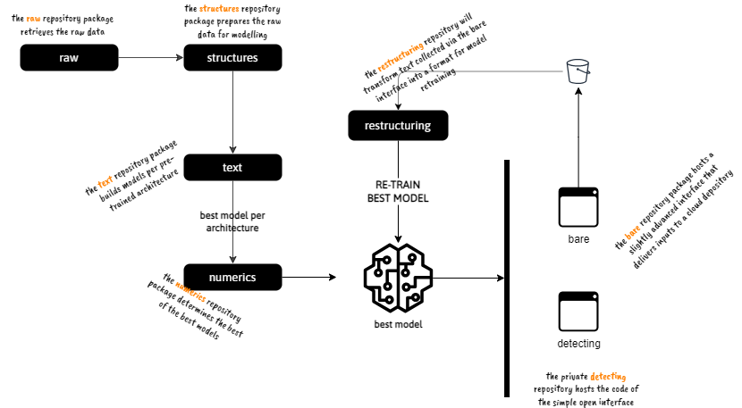

[The Artificial Intelligence Unit](https://github.com/theartificialintelligenceunit)

 

### About
This hub hosts the repositories of a token classification modelling project.  Readers may interact with the model via a  [simple open interface](https://d22j2jhm9iagpk.cloudfront.net/src/c-dispatches-app.html).

 

### Repositories

The diagram outlines the functions of the repositories; and their dependencies.

 

 
 

The `text` package will be re-written during the last quarter of 2025.  The
<a href="https://github.com/membranes/restructuring" target="_blank">restructuring</a> repository package is for restructuring the latest data captures in preparation for (a) human inspection, and (b) usage as a model re-training data source.

 

Additionally

<table style="width: 85%;">
    <colgroup>
        <col span="1" style="width: 26.5%;">
        <col span="1" style="width: 63.5%;">
    </colgroup>
    <thead><tr style="text-align: left"><th>repository</th><th>comment</th></tr></thead>
        <tr><td><a href="https://github.com/membranes/abstracts" target="_blank">abstracts</a></td><td>Background, concept, etc.</td></tr>
        <tr><td><a href="https://github.com/membranes/iac" target="_blank">iac</a></td><td>Limited infrastructure as code notes; intentionally opaque. </td></tr>
</table>

 

### Model & Data

Brief

* [Model Description](https://theartificialintelligenceunit.github.io/intelligence/html/c-dispatches-model-desc.html)
* [Data Description](https://theartificialintelligenceunit.github.io/intelligence/html/c-dispatches-data-desc.html)

 
 

 
 

 
 

 
 
